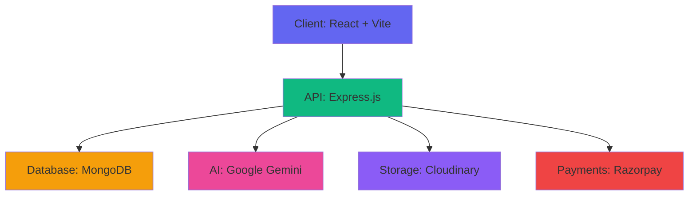

<div align="center">

# ⚡ Portlify

### AI-Powered Resume to Portfolio in Seconds

[](https://portlify.techycsr.dev)
[](https://portlifybackend.techycsr.dev)
[](LICENSE)

[Features](#-features) • [Architecture](#-architecture)  • [Quick Start](#-quick-start) • [API](#-api-reference)

</div>

---

## 🎯 What is Portlify?

Portlify transforms your PDF resume into a beautiful, responsive portfolio website using AI. Upload your resume, get a shareable portfolio URL instantly. No coding required.

```
Resume.pdf → AI Parser → Professional Portfolio → Share Anywhere
```

## 🎬 Demo

https://github.com/user-attachments/assets/e36d6f10-bb27-4ae8-a2b6-81122ef85994

---


**Live Example:** [portlify.techycsr.dev/username](https://portlify.techycsr.dev)

---


## ✨ Features

<table>
<tr>
<td width="50%">

#### 🤖 AI-Powered
- Smart resume parsing with Google Gemini
- Auto skill categorization (6 categories)
- Experience & project extraction
- Contact & social links detection

</td>
<td width="50%">

#### 🎨 Design
- Dark/Light theme support
- Mobile-first responsive design
- Glassmorphic UI elements
- Smooth animations (Framer Motion)

</td>
</tr>
<tr>
<td width="50%">

#### ⚙️ Core
- Custom username URLs
- Real-time profile editor
- Portfolio analytics dashboard
- Export as static ZIP

</td>
<td width="50%">

#### 👑 Premium
- Username customization
- Custom footer branding
- Priority support
- Premium badge

</td>
</tr>
</table>

---

## 🏗️ Architecture



### Request Flow

```
Upload PDF → Extract Text → AI Analysis → Parse Data → Store in DB → Generate Portfolio
```

---

## 🛠️ Tech Stack

<div align="center">

| Layer | Technologies |
|:-----:|:------------|
| **Frontend** | React 18 · Vite · Tailwind CSS · Framer Motion · React Router |
| **Backend** | Node.js · Express · MongoDB · Mongoose · Clerk Auth |
| **AI/ML** | Google Gemini API · PDF Parse · Natural Language Processing |
| **Services** | Cloudinary (Images) · Razorpay (Payments) · Vercel (Hosting) |
| **Tools** | Git · npm · MongoDB Atlas · VS Code |

</div>

---

## 🚀 Quick Start

### Prerequisites

```bash
Node.js 18+ · MongoDB Atlas · Clerk · Google Gemini API · Cloudinary · Razorpay
```

### Installation

```bash
# Clone repository
git clone https://github.com/techycsr/portlify.git && cd portlify

# Backend setup
cd backend && npm install
cp .env.example .env  # Configure environment variables
npm run dev

# Frontend setup (new terminal)
cd frontend && npm install
cp .env.example .env  # Configure environment variables
npm run dev
```

### Environment Variables

<details>
<summary><b>Backend (.env)</b></summary>

```env
PORT=5000
MONGODB_URI=your_mongodb_uri
CLERK_SECRET_KEY=your_clerk_secret
CLERK_PUBLISHABLE_KEY=your_clerk_publishable
GEMINI_API_KEY=your_gemini_key
CLOUDINARY_CLOUD_NAME=your_cloud_name
CLOUDINARY_API_KEY=your_cloudinary_key
CLOUDINARY_API_SECRET=your_cloudinary_secret
RAZORPAY_KEY_ID=your_razorpay_key
RAZORPAY_KEY_SECRET=your_razorpay_secret
```

</details>

<details>
<summary><b>Frontend (.env)</b></summary>

```env
VITE_API_URL=http://localhost:5000/api
VITE_CLERK_PUBLISHABLE_KEY=your_clerk_publishable
VITE_RAZORPAY_KEY_ID=your_razorpay_key
```

</details>

**Access:** http://localhost:5173

---

## 📡 API Reference

### Endpoints Overview

| Category | Endpoints | Description |
|:---------|:----------|:------------|
| **Auth** | `/api/auth/*` | User authentication, registration, username management |
| **Profile** | `/api/profile/*` | CRUD operations, resume parsing, visibility control |
| **Analytics** | `/api/analytics/*` | View tracking, visitor insights, engagement metrics |
| **Payment** | `/api/payment/*` | Premium subscriptions, Razorpay integration |
| **Export** | `/api/export/*` | Download portfolio as static site ZIP |

<details>
<summary><b>View Detailed Endpoints</b></summary>

### Authentication
```http
GET    /api/auth/me
POST   /api/auth/register
PUT    /api/auth/username
GET    /api/auth/check-username/:username
```

### Profile Management
```http
GET    /api/profile/me
GET    /api/profile/:username
PUT    /api/profile
POST   /api/profile/parse-resume
PUT    /api/profile/visibility
DELETE /api/profile/reset
```

### Analytics
```http
GET    /api/analytics
POST   /api/analytics/track
```

### Payments
```http
GET    /api/payment/status
POST   /api/payment/create-order
POST   /api/payment/verify
GET    /api/payment/branding
PUT    /api/payment/branding
```

### Export
```http
GET    /api/export/portfolio
```

</details>

---

## 📁 Project Structure

```
portlify/
├── frontend/
│   ├── src/
│   │   ├── components/    # Reusable UI components
│   │   ├── pages/         # Page components
│   │   ├── context/       # React contexts
│   │   ├── hooks/         # Custom hooks
│   │   └── utils/         # Helper functions
│   └── package.json
│
├── backend/
│   ├── src/
│   │   ├── routes/        # API endpoints
│   │   ├── models/        # Mongoose schemas
│   │   ├── middleware/    # Express middleware
│   │   └── utils/         # Utilities
│   └── package.json
│
├── README.md
└── LICENSE
```

---

## 🎯 Skills Categorization

AI automatically organizes skills into 6 categories:

| Category | Examples |
|:---------|:---------|
| **Languages** | JavaScript, Python, Java, C++, TypeScript, Go, Rust |
| **Frameworks** | React, Node.js, Django, Spring Boot, Express, Next.js |
| **Databases** | MongoDB, PostgreSQL, MySQL, Redis, Firebase, Cassandra |
| **Tools** | Git, Docker, AWS, Kubernetes, Jenkins, GitHub Actions |
| **Concepts** | DSA, System Design, OOP, Microservices, CI/CD |
| **Soft Skills** | Leadership, Communication, Problem Solving, Teamwork |

---

## 🤝 Contributing

Contributions are welcome! Follow these steps:

1. Fork the repository
2. Create feature branch: `git checkout -b feature/amazing-feature`
3. Commit changes: `git commit -m 'Add amazing feature'`
4. Push to branch: `git push origin feature/amazing-feature`
5. Open a Pull Request

---

## 📄 License

This project is licensed under the MIT License. See [LICENSE](LICENSE) for details.

---

<div align="center">

**Made by [@TechyCSR](https://techycsr.dev)**

</div>
